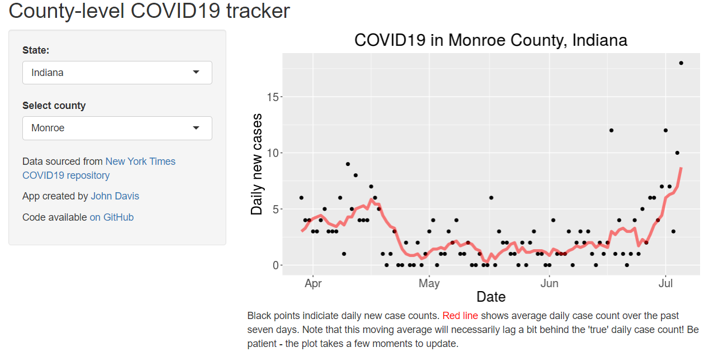

# covid-county-app

A simply Shiny app for tracking COVID19 cases in your county

This is my first Shiny app! I have been using some R code and data from the New York Times to track COVID19 cases in my county and figured it might be useful for other people too.  

App is live on [shinyapps.io](https://johnjdavisiv.shinyapps.io/COVID19_county_tracker/).
